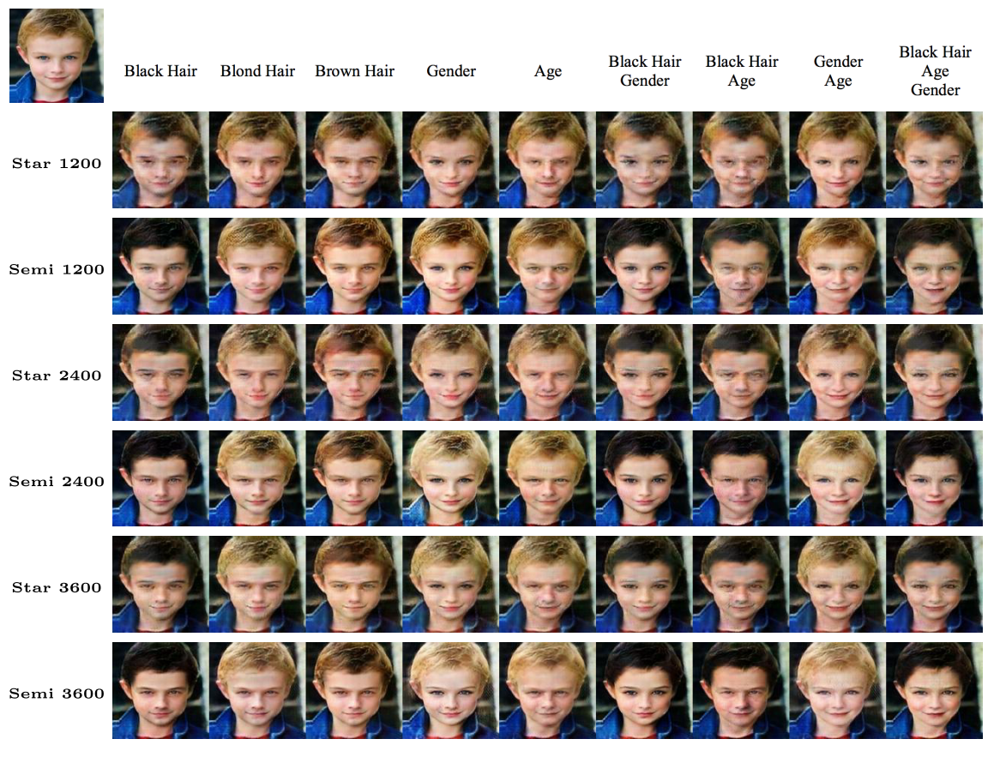

# SemiStarGAN
## SemiStarGAN: Semi-Supervised Generative Adversarial Networks for Multi-Domain Image-to-Image Translation

Source code of [ACCV2018 paper](http://iagentntu.github.io/people/pdf/Hsu_ACCV18_SemiStarGAN.pdf).

## Citation
```
@inproceedings{Hsu:ACCV2018,
  year = { 2018 },
  month = { Nov },
  booktitle = { ACCV },
  title = { SemiStarGAN: SemiSupervised Generative Adversarial Networks for Multi-Domain Image-to-Image Translation },
  author = { Shu-Yu Hsu and Chih-Yuan Yang and Chi-Chia Huang and Jane Yung-jen Hsu },
}
```
## Prerequisites
* Python 3.5
* Tensorflow 1.3.0
* Scipy
* tqdm

## Usage
### Data Preparation
Download CelebA dataset with:
```
$ python download.py
```
The images will be placed under data/celebA/images. Split the images into three folders: train, test and unlabel. Note the label file (ex: list_attr_celeba.txt for CelebA) should place under the same folder as train, test, unlabel folders are place.

### Training
To train a model with SemiStarGAN:
```
$ python main.py --phase=train --image_size=128 --batch_size=16 --data_dir=your_dir
```
If your task is translating among multi-label attributes, use sigmoid instead of softmax
```
$ python main.py --phase=train --image_size=128 --batch_size=16 --data_dir=your_dir --c_method=Sigmoid
```
### Test
To generate translated images for examining (testing) the model:
```
$ python main.py --phase=test_all --image_size=128 --data_dir=your_dir
```
There are other 2 phases to choose for testing:
- --phase=test, assign a binary attributes by giving --binary_attrs=100 (black hair in the case of hair colors)
- --phase=aux_test, test the auxiliary classifier's accuracy on test set

Attributes are now set up with the following sequence in 3 labels problem:
```
'Black_Hair', 'Blond_Hair', 'Brown_Hair'
```
Attributes are now set up with the following sequence in 5 labels problem:
```
'Black_Hair', 'Blond_Hair', 'Brown_Hair', 'Male', 'Young'
```
All the available attributes are:
```
'5_o_Clock_Shadow', 'Arched_Eyebrows', 'Attractive', 'Bags_Under_Eyes', 'Bald', 'Bangs', 'Big_Lips',
'Big_Nose', 'Black_Hair', 'Blond_Hair', 'Blurry', 'Brown_Hair', 'Bushy_Eyebrows', 'Chubby',
'Double_Chin', 'Eyeglasses', 'Goatee', 'Gray_Hair', 'Heavy_Makeup', 'High_Cheekbones', 'Male',
'Mouth_Slightly_Open', 'Mustache', 'Narrow_Eyes', 'No_Beard', 'Oval_Face', 'Pale_Skin', 'Pointy_Nose',
'Receding_Hairline', 'Rosy_Cheeks', 'Sideburns', 'Smiling', 'Straight_Hair', 'Wavy_Hair', 'Wearing_Earrings',
'Wearing_Hat', 'Wearing_Lipstick', 'Wearing_Necklace', 'Wearing_Necktie', 'Young'
```
which are the attributes provided in celebA dataset. One can change the attribute set in main.py <br>
If the attribute set is changed, the `n_label` argument should also be changed.

### Results
Qualitative comparison between the proposed method (Semi) and a state-of-the-art method StarGAN (Star) over the 12-domain problem. The numbers (1200 to 3600) in the first column are the number of labeled data used. The first row is the target domain.
<p align="center"></p>

### Others
If one download the data and run the code, 2 folders will be created.
- data/celebA (where the celebA data are placed)
- assets/ (where one's model checkpoint will be saved)
If users want to train on their own dataset, please put the dataset under data folders.
